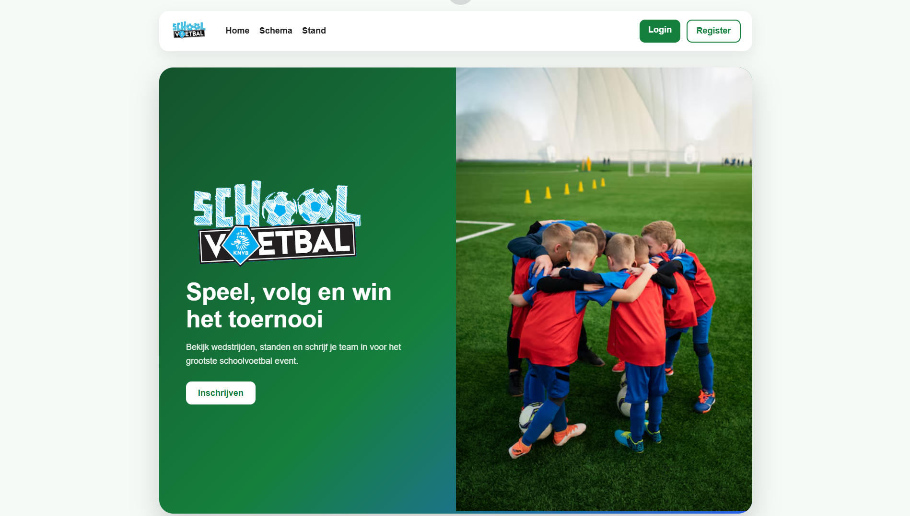
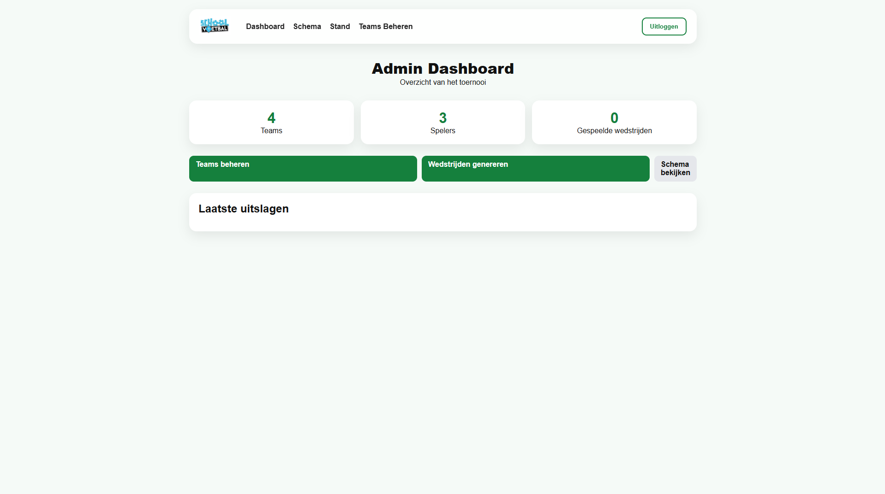
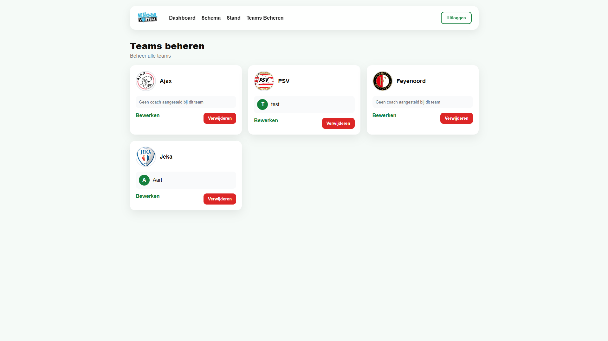
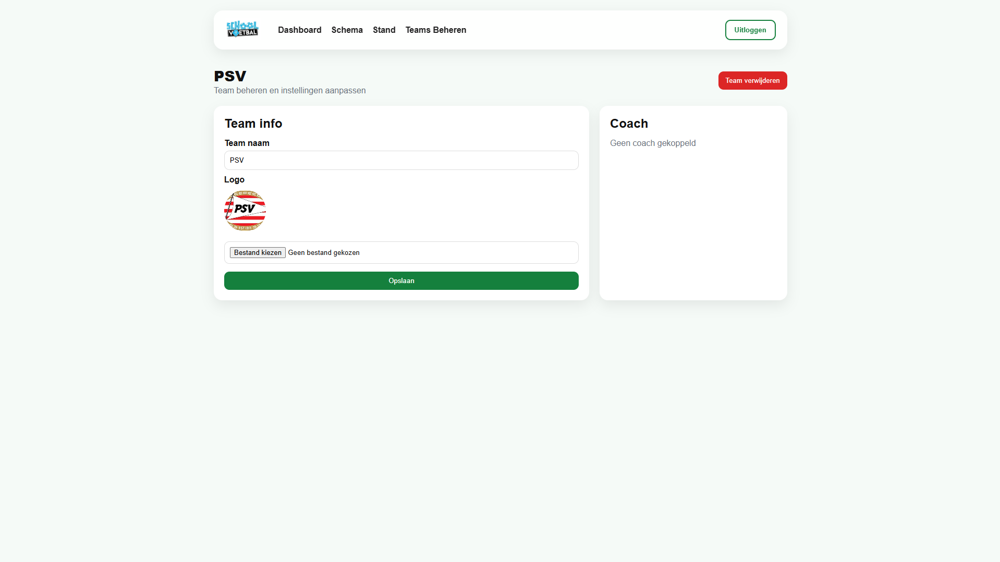
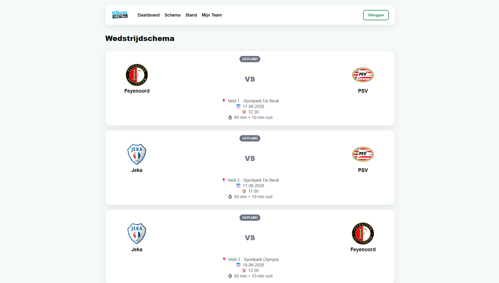
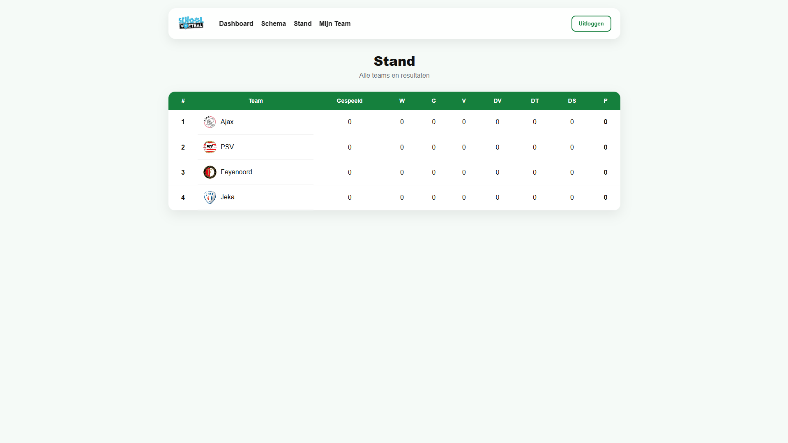
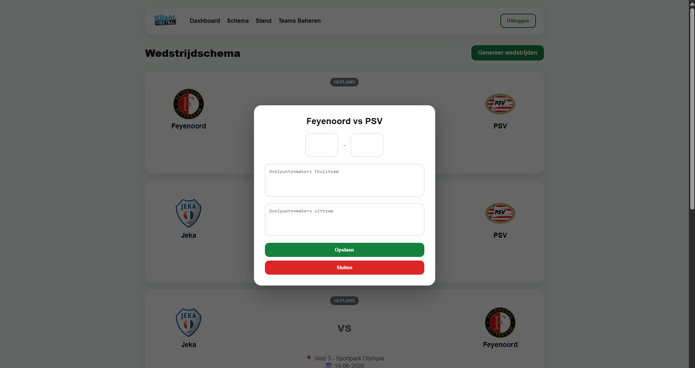
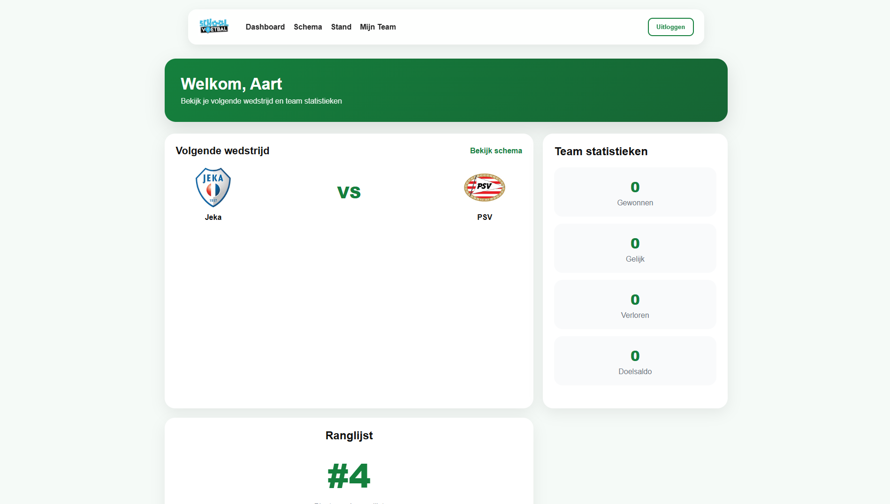
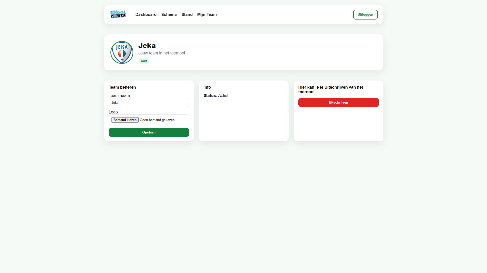

# School Voetbal Webapp

Een Laravel webapp voor het organiseren van schoolvoetbaltoernooien. Leerlingen kunnen teams inschrijven en beheerders kunnen wedstrijden genereren en de stand bijhouden.

## Functionaliteiten
- Teams inschrijven
- Wedstrijden genereren
- Standen bijhouden
- Beheerderspaneel

## Technologieën
- Laravel (PHP)
- Blade templating
- CSS
- JS
- MySQL

## Installatie
```bash
git clone https://github.com/DirkKuijpers/School-Voetbal-Webapp
cd School-Voetbal-Webapp
composer install
npm install && npm run build
cp .env.example .env
php artisan key:generate
php artisan migrate
php artisan serve
```

## Screenshots









